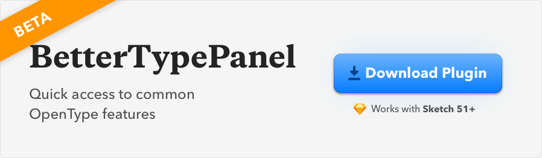

# BetterTypePanel (Beta)

<a href="https://github.com/KevinGutowski/betterTypePanel/releases/download/v0.1.1-4/bettertypetool.sketchplugin.zip">
  
</a>

This plugin lets you easily interact with some common OpenType features. I wanted something to make it easier to apply small caps in sketch (rather than having to go under Show Fonts -> Typography -> Find Option in Giant Typography Pane). It's still early stages for this little plugin so there are likely bugs to be had. Feel free to make an issue and I'll try to get to it. 


## TODOS
- [X] When setting up the UI, set the state of the buttons properly the first time (i.e. check if there is a text object selected or not and then set the state rather than setting the default state of the UI then running `updateUI()`)
- [X] Properly style small caps buttons
- [ ] Basic Support for applying properties to multiple selected Text Layers
- [ ] Support Fractional Forms

## Later Goals
- [ ] Better Support Multiple layer selection
  - [ ] Resolve applying small caps to layers with different fonts
- [ ] Ability to select text and apply transformation to just the selected text range
- [ ] More OpenType Features! (Ligatures, Stylistic Sets, etc)
- [ ] Text Style support (I hope Sketch will consider tweaking things on their end rather me hacking it together)

## Building The Plugin

_This plugin was created using `skpm`. For a detailed explanation on how things work, checkout the [skpm Readme](https://github.com/skpm/skpm/blob/master/README.md)._

Install the dependencies

```bash
npm install
```

Once the installation is done, you can run some commands inside the project folder:

```bash
npm run build
```

To watch for changes:

```bash
npm run watch
```

Additionally, if you wish to run the plugin every time it is built:

```bash
npm run start
```

## Custom Configuration

### Babel

To customize Babel, you have two options:

* You may create a [`.babelrc`](https://babeljs.io/docs/usage/babelrc) file in your project's root directory. Any settings you define here will overwrite matching config-keys within skpm preset. For example, if you pass a "presets" object, it will replace & reset all Babel presets that skpm defaults to.

* If you'd like to modify or add to the existing Babel config, you must use a `webpack.skpm.config.js` file. Visit the [Webpack](#webpack) section for more info.

### Webpack

To customize webpack create `webpack.skpm.config.js` file which exports function that will change webpack's config.

```js
/**
 * Function that mutates original webpack config.
 * Supports asynchronous changes when promise is returned.
 *
 * @param {object} config - original webpack config.
 * @param {boolean} isPluginCommand - whether the config is for a plugin command or a resource
 **/
module.exports = function(config, isPluginCommand) {
  /** you can change config here **/
}
```

## Debugging

To view the output of your `console.log`, you have a few different options:

* Use the [`sketch-dev-tools`](https://github.com/skpm/sketch-dev-tools)
* Open `Console.app` and look for the sketch logs
* Look at the `~/Library/Logs/com.bohemiancoding.sketch3/Plugin Output.log` file

Skpm provides a convenient way to do the latter:

```bash
skpm log
```

The `-f` option causes `skpm log` to not stop when the end of logs is reached, but rather to wait for additional data to be appended to the input

## Publishing your plugin

```bash
skpm publish <bump>
```

(where `bump` can be `patch`, `minor` or `major`)

`skpm publish` will create a new release on your GitHub repository and create an appcast file in order for Sketch users to be notified of the update.

You will need to specify a `repository` in the `package.json`:

```diff
...
+ "repository" : {
+   "type": "git",
+   "url": "git+https://github.com/ORG/NAME.git"
+  }
...
```
